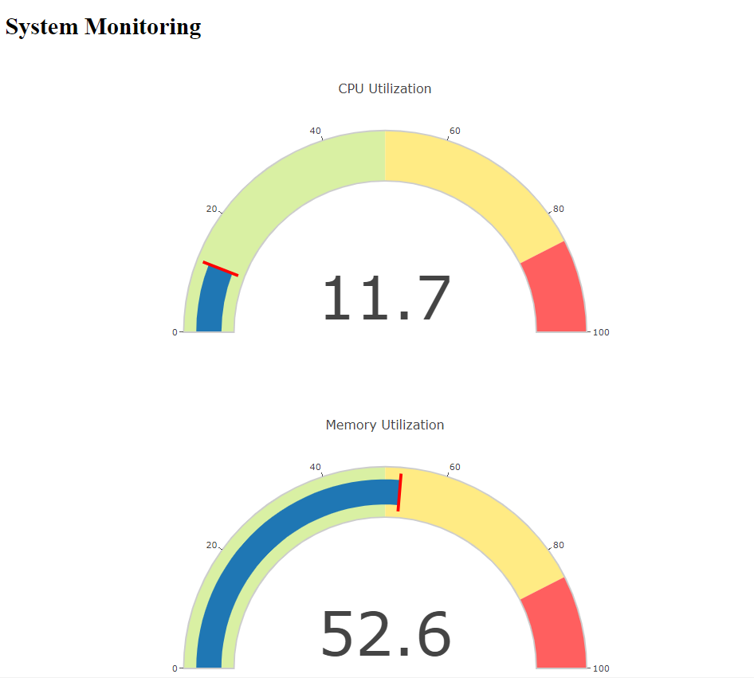

# Native Cloud: Monitoring App
>A python Monitoring application 

---
## Tech stack
- Python
- Docker
- awscli
- ECR
- EKS
---
### Follow the Instructions stated below to run the app:

1. `` git clone https://github.com/Yatheesh-Nagella/Monitoring-App.git`` : clone the code using the command
2.  Install python3 on your local machine 
3. `` pip3 install -r requirements .txt `` : Installs the required libraries 
4. `` python3 app.py `` : run the python app
5. `` docker build -t <image name> `` : build the docker image
6. `` docker images`` : check if image is ready
7. `` docker run -p 5000:5000 <image_name>``: docker run image
8. `aws configure` : configure your awscli by giving Access key ID,  Secret access key ID
9. `` python3 ecr.py `` : helps in creating repository in aws
10. ` docker push <ecr_repo_uri>:<tag>` : Go to aws **ecr** console find the push commands to execute your push 
11. Install kubectl in the local machine and refer below to understand the process of creating eks cluster and node in AWS console
12. `` python3 eks.py ``
13. `` kubectl get pods -n default -w `` : check pods
14. ` kubectl get deployment -n default ` : check deployments
15. ` kubectl get svc -n default `: check service
16. ` kubectl describe pods [] `
17. ` kubectl port-forward svc/native-app 5000:5000 `

---
#### To create an EKS cluster in AWS console
- To create an cluster in aws console we need to attach an IAM role via aws cli with ``cluster-trust-policy.json`` file
- copy paste the below code in cli and ensure you have configures aws credentials
- `` aws iam create-role \
  --role-name eksClusterRole \
  --assume-role-policy-document file://"cluster-trust-policy.json" ``
- Attach a security group allowing port 5000
- Create a node group from amazon linux2, on-demand, t2.micro(free), use default settings for the remaining options.

✨✨Done
